<p align="center">
  <a href="https://partybox.brightpixel.work/">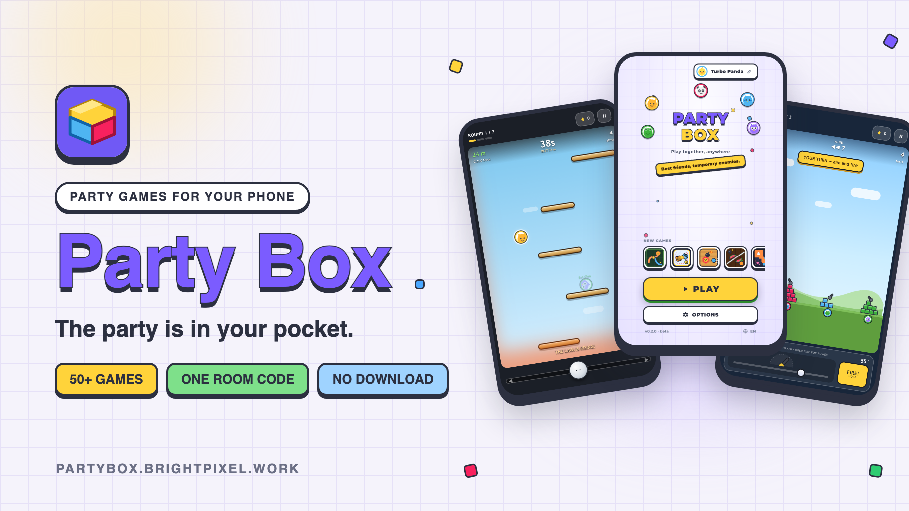</a>
</p>

<h1 align="center">🎉 Party Box</h1>

<p align="center">
  <b>The party is in your pocket.</b><br/>
  50+ multiplayer party games that everyone plays on their own phone — one room code, no download, no account.
</p>

<p align="center">
  <a href="https://partybox.brightpixel.work/"><b>▶ Play now at partybox.brightpixel.work</b></a>
</p>

<p align="center">
  
  
  
  
  
  
  
  
</p>

> **Showcase repository.** This is a public preview of a live web app. **Source code is not included** — only documentation and screenshots. See [Status & Licensing](#status--licensing) at the bottom.

---

## Table of Contents

- [How It Works](#how-it-works)
- [Highlights](#highlights)
- [Screenshots](#screenshots)
- [The Games](#the-games)
- [Tech Stack](#tech-stack)
- [Architecture](#architecture)
- [Engineering Notes](#engineering-notes)
- [Status & Licensing](#status--licensing)

---

## How It Works

1. **One person hosts** — opens Party Box on their phone and creates a room.
2. **Everyone joins** with a 4-letter code or an invite link — on the same couch or on a video call.
3. **Pick a game and play.** Every phone updates at the same moment; the room stays together from one game to the next, with party standings across games.

No console, no TV, no cards, nothing to install. Identity is device-local — just a name and an avatar.

---

## Highlights

- **50+ games** across social, drawing, quiz, board & card, quick-reaction and real-time arena genres.
- **Real-time arena games at 30 Hz** — with client-side prediction and interpolation, so steering feels instant on a phone.
- **3D games in the browser** — pinball, mini golf and bowling with Three.js and Rapier physics.
- **Authoritative server** — the room runs the rules; each player only ever receives their own private state.
- **Survives bad Wi-Fi** — seats are held through disconnects, and a returning player gets their state and the remaining time back.
- **English, Arabic and Hebrew** with full right-to-left layouts; the server sends translation keys, never display text.
- **Topic-based content** — 11 topics (general, football, Bab al-Hara, movies & TV, geography, anime, video games and more), each with its own questions and word packs per game.
- **Host controls** — lock the room, kick, hand over hosting, skip phases; plus spectators, public room browsing, chat, emoji reactions and a ready check.
- **Installable PWA** with sounds, haptics and fullscreen play on phones.
- **Bots** fill empty seats in real-time games, so even two players get a full arena.

---

## Screenshots

### Website

<p><a href="https://partybox.brightpixel.work/">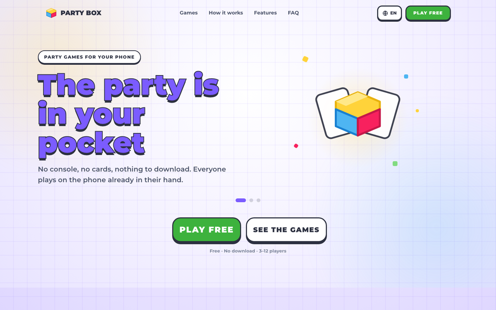</a></p>

### The flow

<p>
  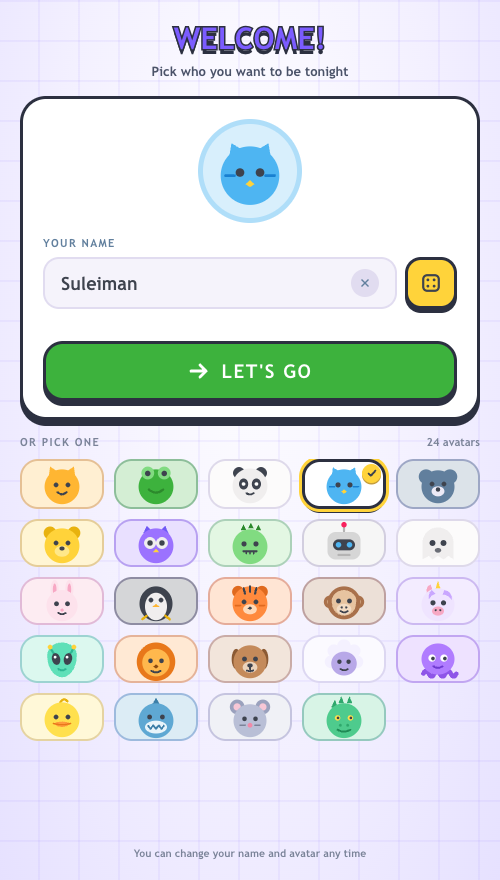
  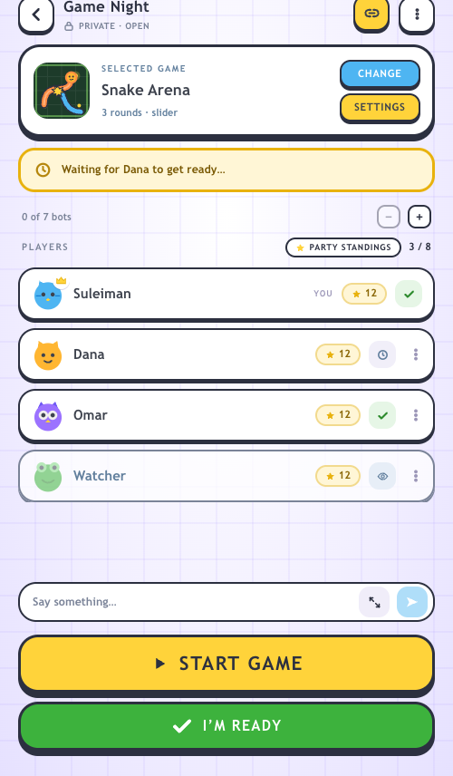
  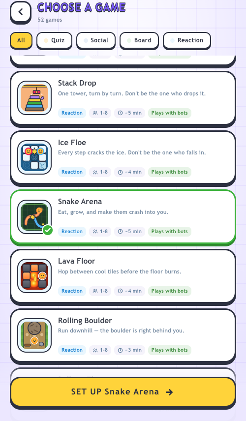
  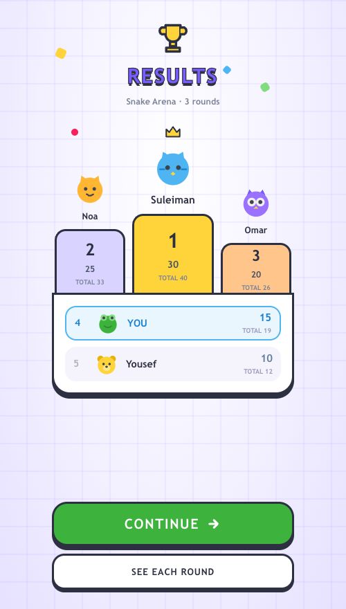
</p>
<sub>Welcome → lobby with ready check and chat → game picker → results podium.</sub>

### In game

<p>
  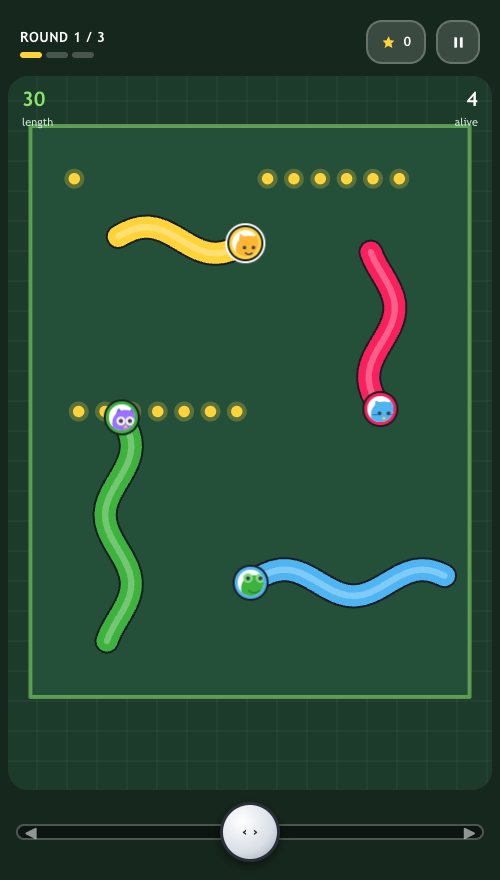
  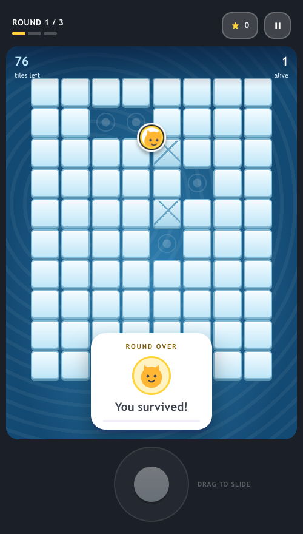
  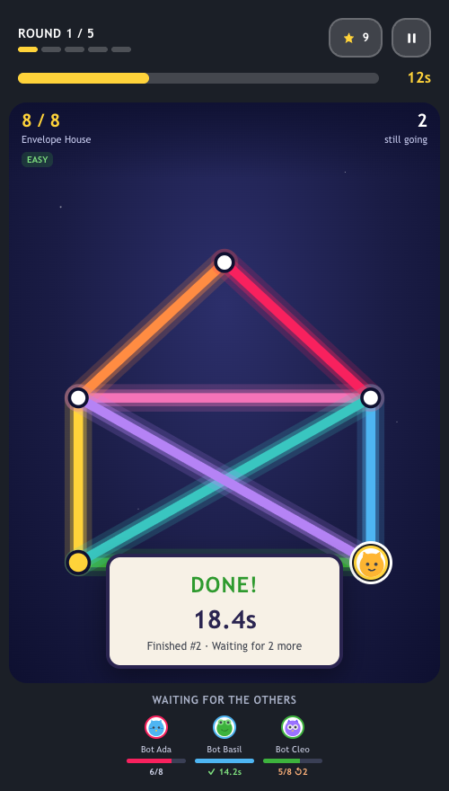
  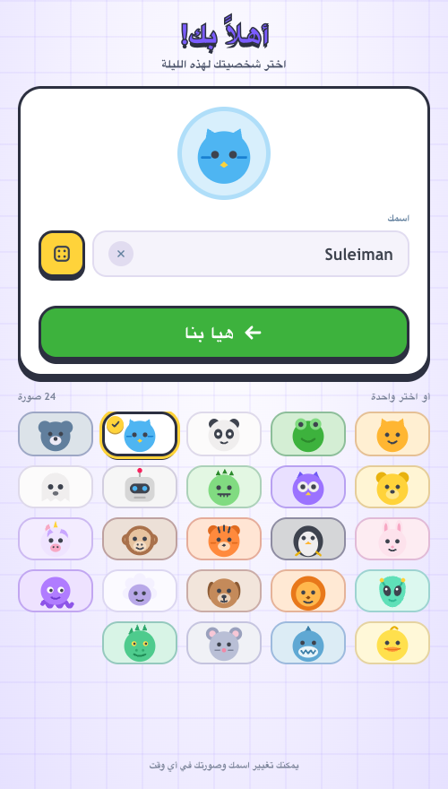
</p>
<sub>Snake Arena and Ice Floe (real-time arena), Star Trail (one-stroke puzzle race), and the Arabic right-to-left layout.</sub>

### 3D games

<p>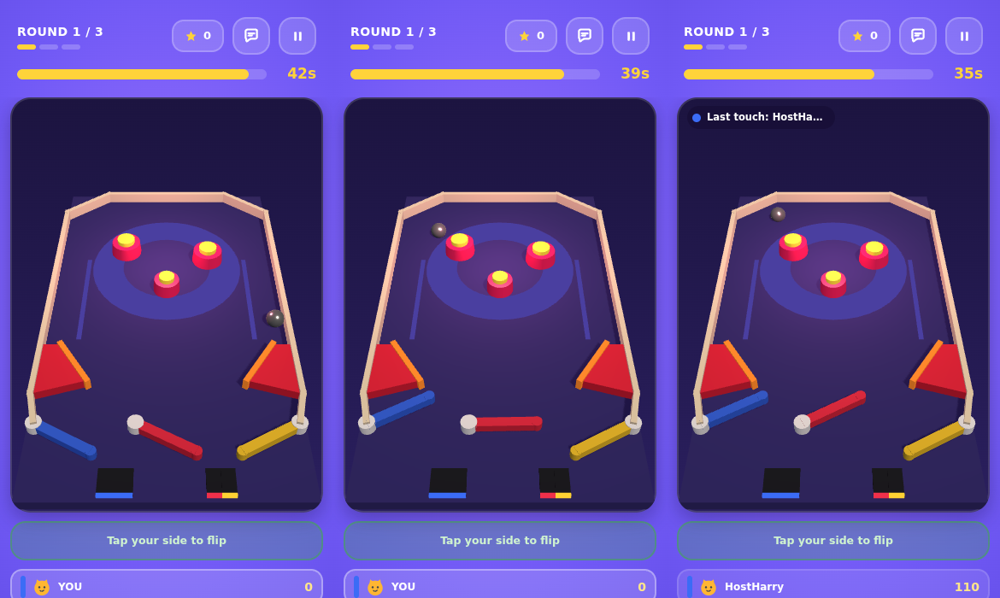</p>
<sub>Flipper Party — everyone holds a flipper on one shared, physics-driven table.</sub>

<p>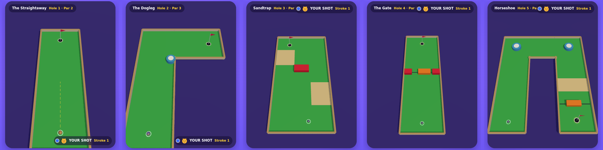</p>
<sub>Mini Golf — take turns putting through hand-built holes.</sub>

---

## The Games

<p align="center">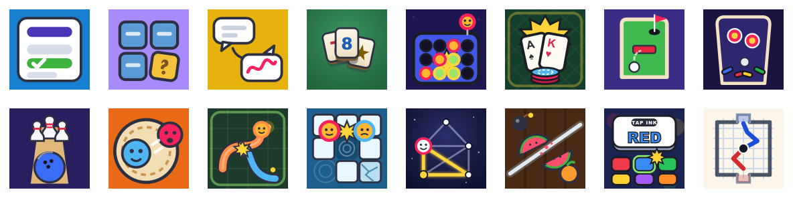</p>

| Genre | Examples |
|---|---|
| **Social & bluffing** | Odd One Out, Best Answer Wins, Alibi, Most Likely To, Two Truths and a Lie, Rank It, In Between, Guess the Player, Mad Lib Stories |
| **Drawing** | Scribble Telephone, Blind Draw, Add One Line |
| **Quiz** | Quiz, Fake Answer, Higher or Lower, Order It |
| **Board & card** | Rummikub, Blackjack, Checkers, Connect Four, Dots and Boxes, Paper Soccer, Memory Match, Card Grab, Bayoda, Match |
| **3D** | Flipper Party (pinball), Mini Golf, Bowling Night |
| **Quick reaction** | Echo, Color Clash, Perfect Stop |
| **Real-time arena** | Sumo Royale, Snake Arena, Ice Floe, Bumper Cars, King of the Hill, Hot Potato, Knife Rain, Sky Climb, Lava Floor, Fruit Slice, Maze Rush, Star Trail and more |

Several classics also come as **arcade editions** — the same rules with a new look and light, dark and neon themes.

---

## Tech Stack

| Layer | Tech |
|---|---|
| **Language** | TypeScript 5.9 across client, server and shared code |
| **Realtime server** | Node.js 22 · Colyseus 0.16 (schema v3, WebSocket transport) · Express 5 · Zod 4 |
| **Physics** | Rapier 3D (WASM) for pinball and mini golf |
| **Web client** | React 19 · React Router 7 · Vite 8 · Tailwind CSS 4 |
| **Renderers** | DOM for most games · PixiJS 8 for board games · Three.js for 3D games |
| **i18n** | English, Arabic, Hebrew — RTL layouts, ICU plurals, missing keys fail the build |
| **Monorepo** | pnpm workspaces · Turborepo |
| **Deploy** | One Docker image, one process, one port — sized for a small VPS |
| **Testing** | Vitest · 100+ live-server scripts: smoke test, per-game play and render checks, reconnect and RTL checks |

---

## Architecture

```
          phones (any browser, installable PWA)
    ┌─────────┐   ┌─────────┐   ┌─────────┐
    │ host    │   │ player  │   │ player  │
    └────┬────┘   └────┬────┘   └────┬────┘
         │  inputs      │             │
         ▼              ▼             ▼
   ┌──────────────────────────────────────────┐
   │  Colyseus room — authoritative           │
   │  LOBBY → CONFIGURE → READY → PLAY → RESULTS│
   │  game module: rules · bots · content     │
   └──────────────────────────────────────────┘
      state patches · private messages · 30 Hz ticks
```

- **A game is three small parts:** a shared manifest (name, players, rules, settings), a server module (rules, scoring, bots) and one React screen. Registries on both sides are checked against each other at boot, so a half-added game can't ship.
- **Settings screens are generated** from each manifest's declared rules — steppers, toggles, segmented choices.
- **Private state stays private** — each player receives only their own hand, role or word.
- **Clocks send time remaining, not deadlines**, because phone clocks drift.
- **Real-time games** run a shared step function on the server at 30 Hz; each phone predicts its own piece with the same function and draws everyone else ~70 ms behind, interpolated.
- **Board games** replay turn events as animation, then re-read the true board, so animation can lag but never disagree with the server.

---

## Engineering Notes

A few problems worth solving properly:

- **A dependency bug that corrupted strings of exactly 255 bytes** in the state-sync library — worked around with a one-length padding helper, and the broken release pinned out.
- **A blank screen on phones joining over a local network**, because a browser ID API only works on secure origins — replaced with a secure random source that works everywhere.
- **Steering that felt sticky** in real-time games: the input rate limit sat below what a moving thumb sends. Measured (118 inputs dropped in 15 s), raised, and verified at zero.
- **Players turning invisible** after a quick refresh, and boards arriving in the same packet as ticks on real Wi-Fi — both race conditions reproduced and fixed with scripted checks.
- **Frozen game tabs** when the phone's GPU dropped the WebGL context — recovered instead of freezing.

---

## Status & Licensing

**Status:** live at **[partybox.brightpixel.work](https://partybox.brightpixel.work/)** and actively developed.

This repository exists to **showcase** the project. It contains:

- This README
- Screenshots and game icons

It does **not** contain:

- Source code (client, server, shared packages)
- Game content packs, sounds or art source files
- Deployment configuration or credentials

> **© All rights reserved.** All text, images and design content here are the author's. No license is granted: you may not copy, modify, redistribute or use any of this material — including the screenshots — without prior written permission. Viewing on GitHub is fine; everything else is not.

Made by **Suleiman** · [BrightPixel](https://brightpixel.work) · for collaboration or licensing, open an issue or reach out through the website.
